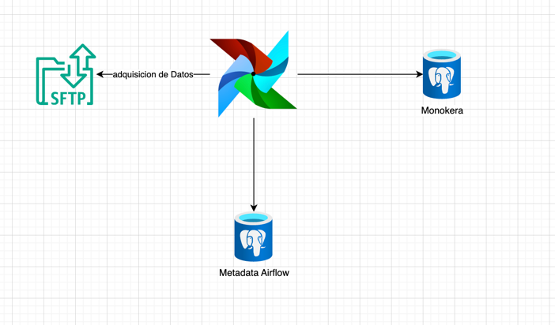

# monokera
El proyecto tiene una arquitectura con los componentes:
1. SFTP
2. POSTGRESQL
3. AIRFLOW

Dentro del proyecto se vera el despliegue de los componentes en un ambiente Docker

El modelo de datos es creado por medio de python, utilizando un PythonOperator.

El proceso de ETL
se base en:
1. Extraccion de datos desde un servidor SFTP donde podra ser cargada la informacion como acceso publico a negocio
2. Se realiza enriquecimiento de datos para las tablas
   2.1. Insured: Se Realiza completitud de informacion dado que los registros como genero y nombre debe prevalecer el del asegurado
3. Se realiza separacion de objetos de negocio dado que el modelo relacion se asocia por policy_number.